---
category:
  - 技能
tag:
  - 安全
date: 2022-12-16
---

# keepassxc 密码管理器

keepassxc 是一个开源免费的密码管理器，它拥有众多强大的功能，可以高强度保护我们的密码。如果你注册了很多账户，记不住密码，经常需要重置密码，那么你一定要试试 keepassxc，它会让你再也不用担心记不住密码的问题！

## 开始使用

### 安装

首先到[官网](https://keepassxc.org)安装 keepassxc，点击图中的*Download for Windows*即可下载安装程序。

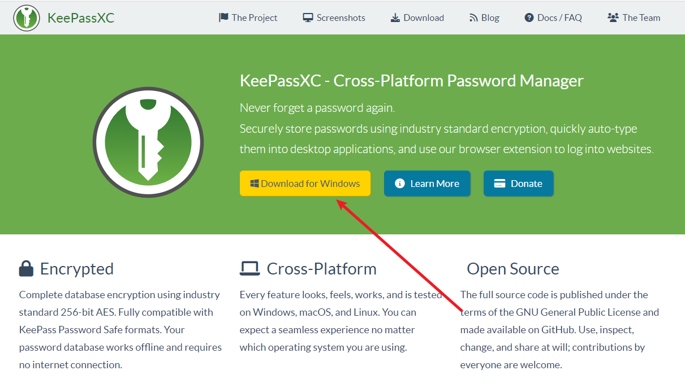

下载完成后正常安装，这一步没有什么难点，安装完成之后，我们就可以开始学习使用这个强大的密码管理软件了。

### 创建数据库

打开 keepassxc 软件，应该就会显示出类似的界面。在第一次使用之前，我们需要先创建一个数据库，之后的所有密码，都会以加密的方式，安全地存储在数据库之中。即使数据库泄露，我们的密码也会被安全的保护着。

点击图中的创建数据库按钮，就会打开对话框，首先先要为数据库起一个名字。

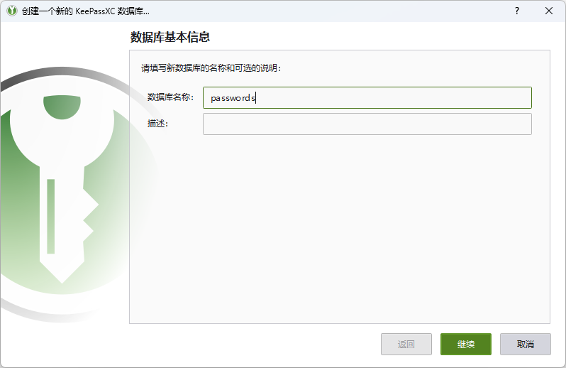

接下来需要设置数据库的格式和加密设置。这里的配置其实无需改变，默认配置即是最佳配置。数据库格式默认也即最新的 KDBX 4 格式，解密时间如果没有特殊要求的话，默认的 1 秒足够。更长的解密时间会使用更多的转换次数，数据库也就更加安全，但是对应的，数据库的打开和保存也会花费更多时间。

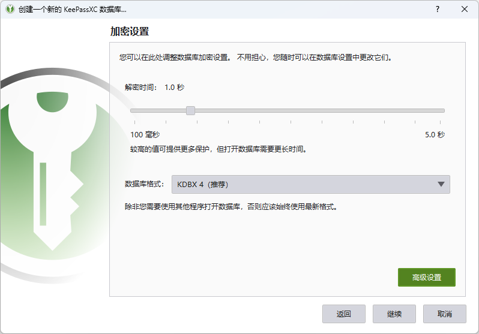

如果有兴趣的话，也可以点击右下角的*高级设置*，对加密算法和转换次数进行配置。配置完成之后，别忘了点击*基准 1 秒延迟*按钮，会根据系统配置自动修正转换次数，让解密数据库所用的时间正好为 1 秒钟，在安全和可用性之间达到平衡。

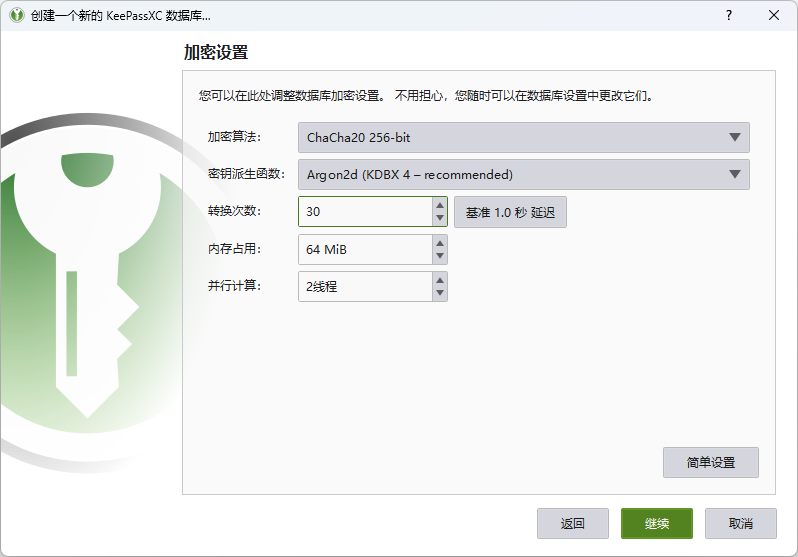

然后需要为数据库添加一个密码，以后每次使用 keepassxc 之前都需要输入密码才能打开数据库。**一旦忘记密码，就会永久丢失数据库，所以务必牢记密码！**

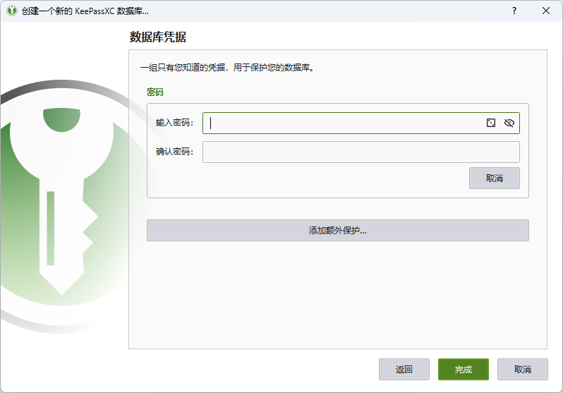

又或者，你觉得光是用密码不够安全，也可以点击*添加额外保护*，为数据库再添加一个密钥文件。这样，以后打开数据库的时候，不仅需要输入密码，还需要提供密钥文件才能解密数据库。

密钥文件不一定非要是 keepassxc 提供的格式，它其实可以是任意文件类型，例如一个文本文档、一首音乐、一段电影等等。所以你可以任意指定一个文件作为密钥文件，这样也可以提供更好的伪装。**但是要记住，密钥文件不可修改，一旦密钥文件哪怕修改了一丁点，就会导致数据库永久无法打开。**

点击图中的*生成*按钮，选择密钥文件的文件名和路径，就可以生成一个密钥文件。这是 keepassxc 专属的`keyx`格式文件，大多数程序无法识别，所以不会被轻易打开和修改。

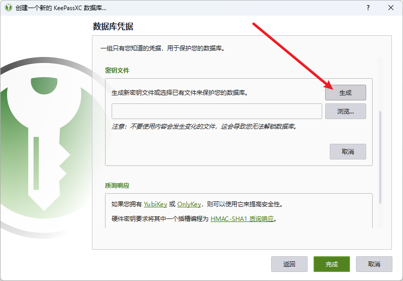

设置好密码之后，就可以点击完成。这时候应该会弹出对话框来保存数据库。推荐将数据库保存到 OneDrive 或者坚果云等网盘的同步文件夹中，这样以后数据库修改和保存之后，就可以自动同步到网盘中。以后就算本地数据库丢失，也不用担心了。

::: warning
如果你不想每次都需要输入密码解锁，可以只使用密钥文件解锁数据库，这样每次解锁的时候只需点击鼠标确认。但是密钥文件保存在系统之中，任何可以接触密钥文件的程序或者人都可以直接解锁数据库，极大地降低了数据库的安全性。

当你使用这种方法的时候，需要自己来保证系统的安全性，不要随意安装不信任的软件，也不要将电脑交给不信任的人使用。降低密码保护的安全性，需要自己来负责。
:::

### 新建群组

为了让密码配置井然有序，最好先根据用途为密码条目分组。右键点击根群组并选择新建群组，然后为群组分配一个名字，需要的话再添加备注和图标。分配好群组之后，就可以分门别类的存放密码，以后也便于查找和使用。

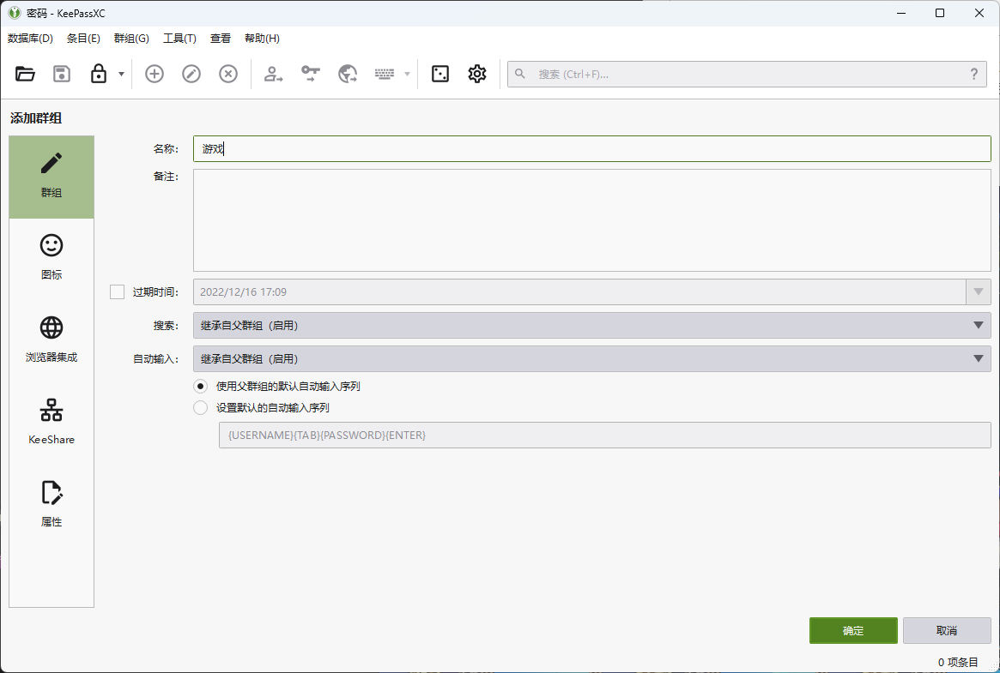

### 保存密码

keepassxc 的首要功能就是保存密码。选择一个群组，然后点击菜单栏*条目—>新建条目*或者工具栏的*添加新条目*工具，都可以打开添加条目功能。

然后填写要保存的密码配置，各文本框的简单说明如下。

::: info
你可以通过查看程序标题栏的名字，或者通过任务管理器里显示的名字来获取一个程序的标题。
:::

- 标题，需要保存的密码的名字。如果要作为自动填充使用，标题必须和被填充的程序的标题相同
- 用户名，需要保存的用户名。如果数据库中已经有相同的用户名，可以自动补全
- 密码，需要保存的密码。如果要使用密码生成器，可以点击密码文本框右边的方格按钮。同时密码文本框下方同时还会以颜色表示密码的强度。
- URL，密码对应的网站。当点击文本框右边的下载按钮时，会从网站下载 favicon 作为条目的图标使用。
- 标签，可以为条目添加标签，只支持英文。
- 过期时间，指定密码的过期时间，一般情况下无需指定。当对密码安全有更高的要求时，可以指定过期时间，并在到期之后更改密码。
- 备注，如果需要的话填写一些备注信息。

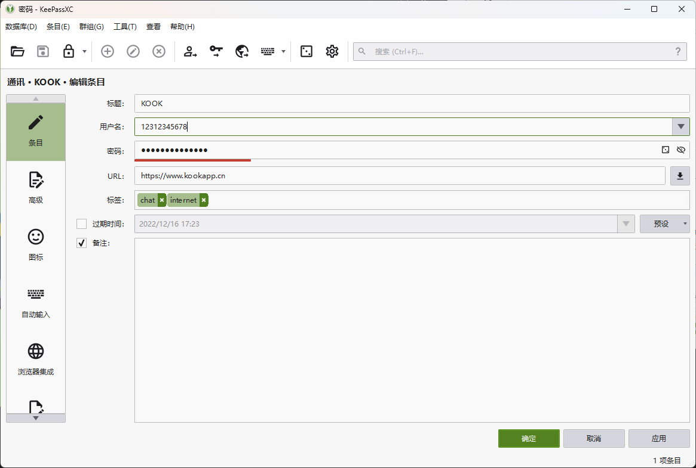

### 使用密码

密码保存好之后，以后要怎么使用呢?很简单，打开 keepassxc，找到你要使用的密码条目，右键点击条目，选择*复制用户名*和*复制密码*功能，就可以将用户名和密码粘贴到需要的地方了。你也可以使用快捷键或者工具栏图标(工具栏第三列的几个图标)来操作，默认的快捷键为*Ctrl+B*和*Ctrl+C*。

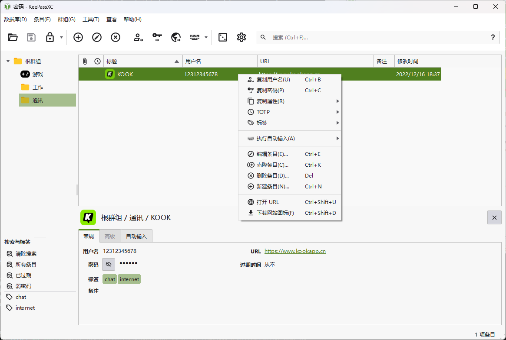

很多软件支持访问剪贴板功能，为了防止因为复制粘贴密码而导致的密码意外泄露问题，keepassxc 采用了超时机制，默认情况下经过 10 秒就会自动清空剪贴板，保护用户的密码安全。

### 自动填充

keepassxc 还有一个非常强大的自动填充功能，可以用来自动填写用户名和密码。

首先点击菜单栏*工具->设置*或者工具栏的齿轮图标，打开设置界面。选择*常规->自动输入*，为全局自动输入分配一个快捷键(如图中的*Ctrl+Alt+A*)，然后点击保存。默认情况下，每次执行自动输入之前，都会弹出对话框询问。你可以取消*总在执行自动输入前询问*前的对勾，这样如果数据库中只有一个匹配的条目，就会直接开始自动填充。当存在多个匹配的条目的时候，才会弹出对话框询问。

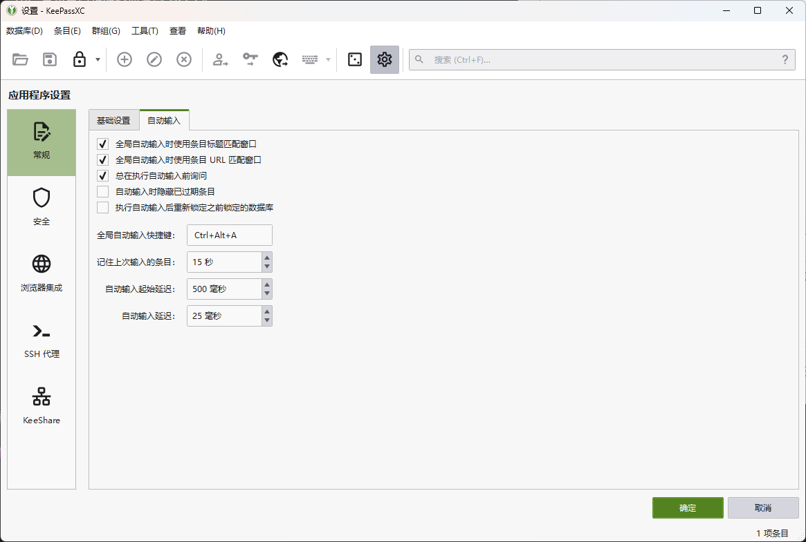

然后打开要自动填充的程序，先用鼠标点击一下输入框，出现输入光标之后，再按下全局快捷键，这时候会弹出全局输入对话框，选择要输入的用户名和密码，点击*输入序列*按钮，即可自动输入密码。

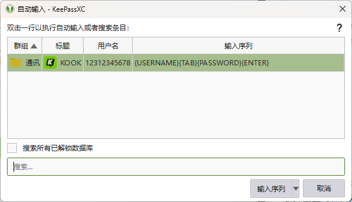

你可以看到上图中输入序列有一串英文代码，这代表着 keepassxc 如何执行自动输入。默认的序列为`{USERNAME}{TAB}{PASSWORD}{ENTER}`，含义是，当执行自动输入的时候，先输入用户名，再按 TAB 键切换到密码输入框，然后输入密码，再按回车确认。

::: info
你可以在官方的[参考手册](https://keepassxc.org/docs/KeePassXC_UserGuide.html#_auto_type_actions)中查看所有自动填充代码。
:::
你也可以更改默认的输入序列，有两种更改方式，第一种是在编辑条目的界面中找到自动填充的配置，为单个条目采用不同的输入序列配置。第二种是在群组上右键点击并选择*编辑群组*，这里更改的输入序列会应用到群组内的所有条目上。如果你想更改所有条目的输入序列，可以编辑根群组的配置。

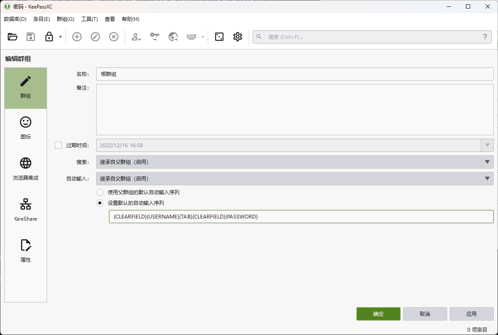

上图中的输入序列`{CLEARFIELD}{USERNAME}{TAB}{CLEARFIELD}{PASSWORD}`，会先清除用户名和密码框已有的内容，再自动填充，而且在结束之后不按回车，需要用户手动确认。你也可以试试这一种，看看自动填充的效果怎么样。

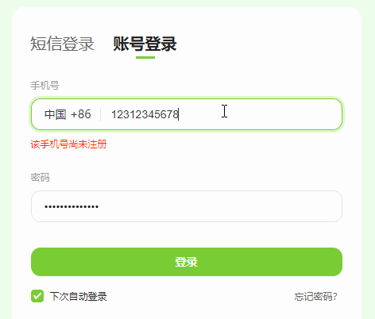

::: warning
自动填充功能并不是在所有程序(如 QQ)中都能使用，只有那些支持通过剪贴板复制密码的程序才能够使用自动填充功能来输入密码。
:::

## 进阶技巧

### 密码生成器

点击菜单栏*工具->密码生成器*或者工具栏第四列的方块图标，即可打开 keepassxc 的密码生成器界面。另外，在新建和编辑条目的时候，也可以通过密码输入框右边的图标来打开密码生成器。

通过密码生成器就可以生成高强度的随机密码，然后保存到 keepassxc 里或者是复制到其他程序中使用。密码文本框右边的两个按钮为*重新生成密码*和*复制到剪贴板*。如果对生成的密码不满意，还可以切换为高级界面，可以选择要使用和排除的字符。

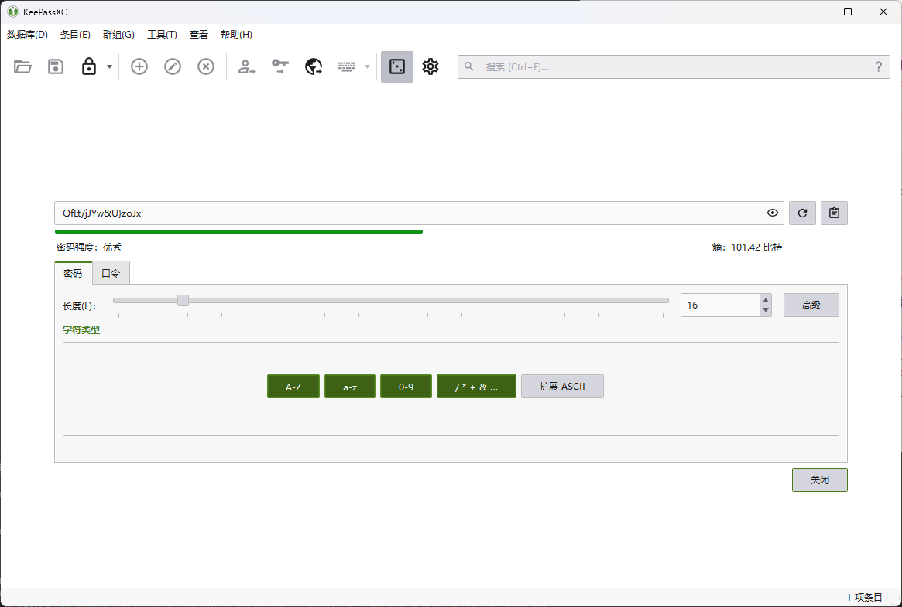

::: warning
密码生成器没有历史保存功能，一旦关闭界面再打开，生成的密码即发生改变。所以如果需要多次复制同一个随机生成的密码，最好将其先保存为条目，不然很容易丢失刚刚生成的密码。
:::

### 浏览器集成

浏览器也是一个桌面程序，所以 keepassxc 同样可以在浏览器中自动填充。在这种情况下，需要将网页的标题设置为条目的标题。不过这同样需要事先在 keepassxc 中添加条目。

如果要将浏览器中输入的密码自动保存到 keepassxc 中呢？keepassxc 同样提供了浏览器集成功能，可以满足这个功能。

首先需要安装浏览器扩展，[chrome 商店](https://chrome.google.com/webstore/detail/keepassxc-browser/oboonakemofpalcgghocfoadofidjkkk)和[edge 商店](https://microsoftedge.microsoft.com/addons/detail/keepassxcbrowser/pdffhmdngciaglkoonimfcmckehcpafo)均可以安装。

然后通过工具栏的齿轮图标打开设置界面，启用*浏览器集成功能*，并在*为这些浏览器开启集成*下勾选要开启集成的浏览器。

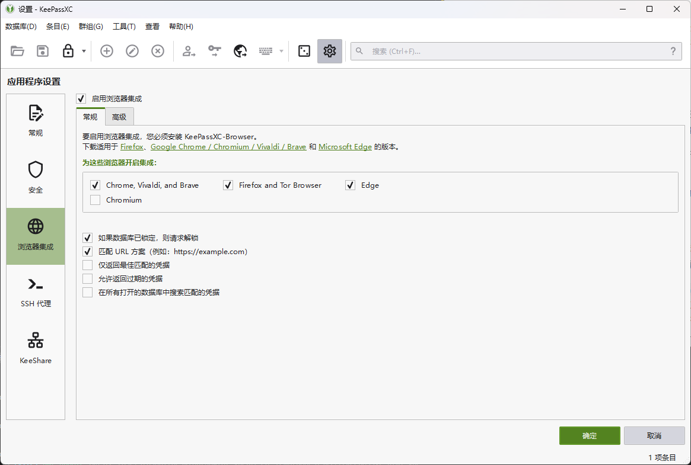

然后回到浏览器中，点击刚刚安装好的 keepassxc 扩展，点击连接按钮，为浏览器输入一个名字。keepassxc 变为绿色时，说明扩展已经和 keepassxc 成功连接，以后在浏览器中填写密码的时候，就会弹出提示，询问是否保存到 keepassxc 之中。

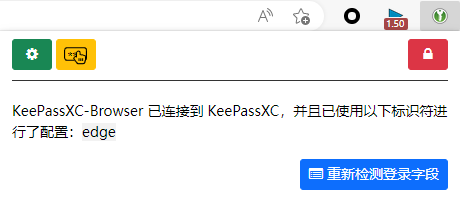

### 关闭防截屏

keepassxc 默认开启了防截屏功能，在截图、录屏和远程控制的时候，keepassxc 窗口会显示为一片黑色，有效的保护了因为截屏而产生的密码泄露问题。不过如果你真的想把 keepassxc 作为截屏或者录屏的一部分，也可以关闭这个功能。

关闭方法很简单，为 keepassxc 添加`--allow-screencapture`参数即可。你可以在桌面上找到 keepassxc 的快捷键，然后右键点击选择*属性*，在*目标*的最后面添加参数。如果 keepassxc 的路径含有空格，前面的一部分会被双引号包裹起来，添加参数的时候要将光标放到双引号外面，然后输入空格再粘贴参数。

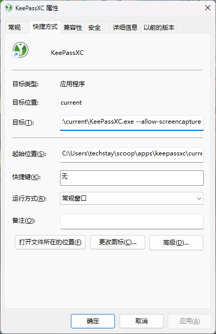

### 引用条目

一些条目可能属于同一家公司提供的服务，它们使用相同的用户名和密码。这时候分别填写就是一件很麻烦的事情，keepassxc 提供了引用条目的功能来解决这个问题。

右击要复制的条目，然后点击*克隆条目*，在弹出的对话框中勾选*替换用户名和密码为引用*并点击确定按钮。然后按需修改克隆出来的条目，它的用户名和密码都是引用，修改原条目的属性，会自动修改引用的属性，非常方便。

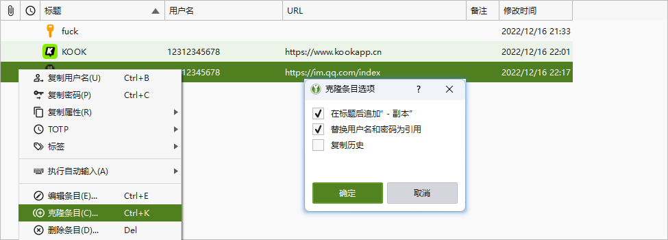

### TOTP

一些网站支持基于 TOTP 的双因子验证功能，keepassxc 同样可以保存 TOTP 密钥。

在开启双因子验证的时候，网站通常会提供一个二维码或者是密钥。右击要添加 TOTP 的条目，选择*TOTP->设置 TOTP*，然后将从网站得到的密钥复制到*Secret 密钥*处，并点击确定。之后就可以从 keepassxc 中获取 TOTP 验证码了。

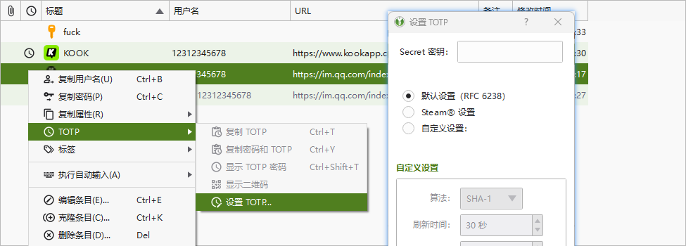

::: warning
TOTP 验证码基于时间产生，使用的时候需要保证系统的时间准确无误，否则产生不了正确的验证码。

俗话说得好，不要把鸡蛋放在同一个笼子里。将账户密码和 TOTP 密钥分开存放是安全性更高的选择，将它们一起保存到 keepassxc，更容易发生账户丢失和密码泄露的问题。
:::

### 为条目添加更多属性

之前我们设置密码条目的时候，只填写了最基本的几项配置。不过如果你的账户需要保存更多属性的话，keepassxc 同样支持。

在编辑条目的时候，选择左边的*高级*分类，即可切换到更详细的内容填写界面，在这里可以填写更多账户相关的配置。如果有需要保密的信息的话，选中右边的*保护*复选框就可以隐藏信息了。要查看已经隐藏的信息，点击复选框下方的*显示/隐藏*按钮即可。

你还可以在下面为账户添加附件，例如一些证件的图片等等。keepassxc 都可以帮你保存起来。


### 其他配置

keepassxc 的配置项众多，可以根据需要开启。

要优化 keepassxc 的启动行为，可以选中*启动*分类下的*系统启动时自动启动 keepassxc*和*解锁数据库后最小化窗口*。

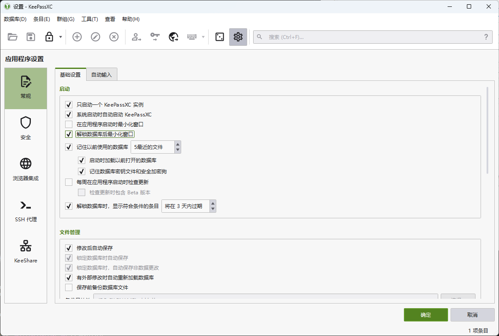

点击关闭按钮，keepassxc 会自动退出。要让它驻留在系统托盘区域，可以启用*用户界面*下的*最小化而不是退出应用程序*和*显示任务栏图标*以及*将窗口最小化至任务栏*。


如果你的系统支持 Windows Hello 或 Touch ID 功能，可以启用快速解锁，下次解锁数据库的时候可以通过指纹解锁或者面容解锁，无需输入密码。

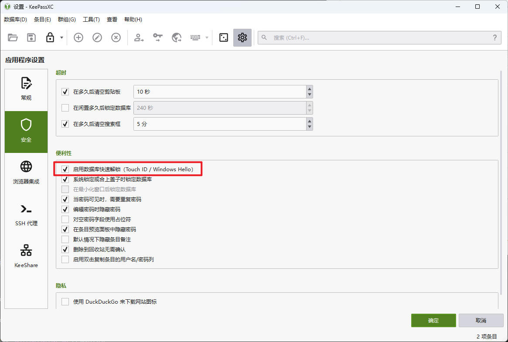

### 以管理员权限自启

keepassxc 默认会以普通权限启动，无法在管理员权限启动的窗口中执行自动填充。如果要自动填充的话，需要 keepassxc 自己也以管理员权限启动。但是 keepassxc 自带的自启功能，只能以普通权限启动，要让 keepassxc 以管理员权限自启，需要利用计划任务功能。

首先，关闭 keepassxc 里的自启功能，然后打开管理员权限的命令提示符或者 powershell 窗口，然后运行下面的代码创建 keepassxc 的计划任务。注意需要将`KeePassXC.exe`的替换为 Keepassxc 的绝对路径，如果路径里有空格的话，要将路径整个包括在双引号之中。

```sh
schtasks /create /tn keepassxc /tr "KeePassXC.exe" /sc ONLOGON /rl HIGHEST
```

创建完成之后，使用下面的命令运行 keepassxc，如果成功打开，说明计划任务创建成功，下次开机的时候 keepassxc 就会自动启动。

```sh
schtasks /run /tn keepassxc
```

如果没有任何事情发生，说明 keepassxc 的路径设置有问题，需要删除计划任务并重新创建。

```sh
schtasks /delete /tn keepassxc
```
