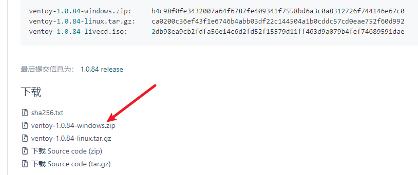
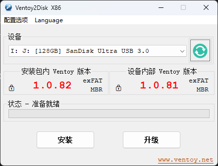
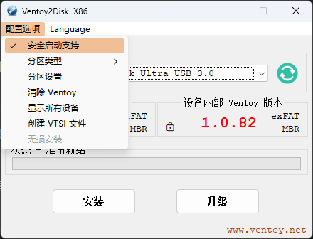
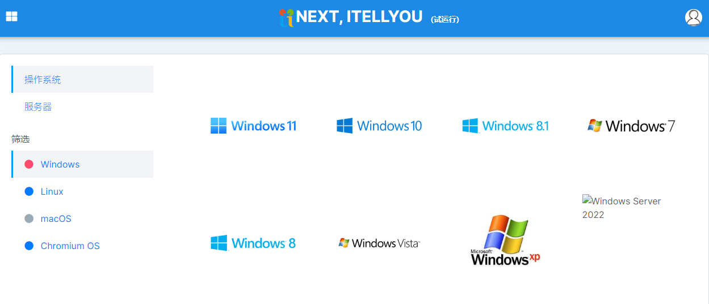
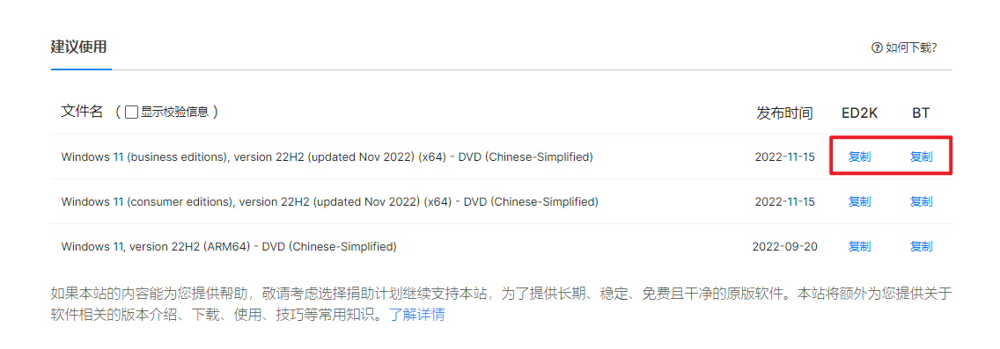
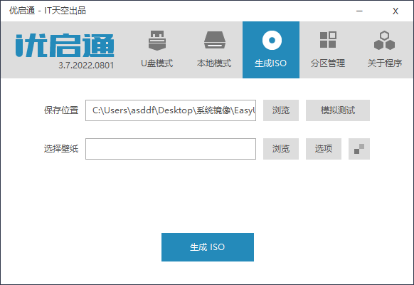
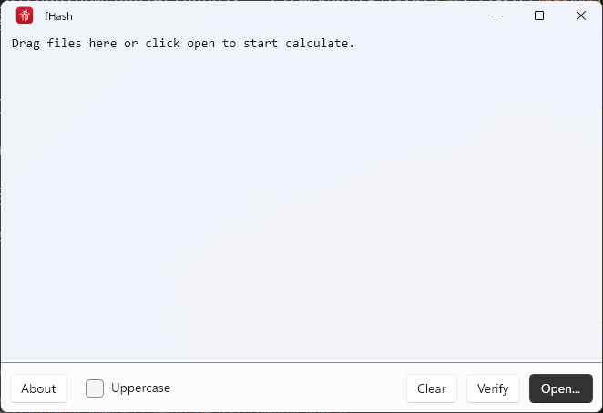
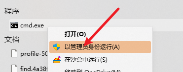

---
category:
  - 技能
tag:
  - 装机
date: 2022-12-11
---

# 使用 ventoy 制作万能启动 U 盘

经常装系统的同学应该对做启动盘非常的熟悉，毕竟每次安装系统的时候都必须制作启动盘。如果安装的系统和之前不一样，那么还得重新做一次启动盘。

有没有什么工具能够一次性搞定这个工作，从此告别制作启动盘的繁复步骤呢？还真有这么一个工具，这就是本文要介绍的*启动盘制作神器 ventoy*！

## 下载 ventoy

首先到官网<https://www.ventoy.net/cn/download.html>下载 ventoy。推荐通过码云的[链接](https://gitee.com/longpanda/Ventoy/releases/)来下载，速度较快。



下载完成后解压文件，找到*Ventoy2Disk.exe*，即可启动 ventoy 主程序。

## 功能介绍

打开 ventoy，应该会看到类似下图的界面。

- 菜单栏可以设置一些功能项。
- 设备部分列出了当前的 U 盘设备，如果没有显示出来的话，可以重插一下，然后按右边的刷新按钮看看。
- 设备下面的部分列出了当前本地的 ventoy 版本和 U 盘里安装的 ventoy 版本。如果下载了新版的 ventoy，点击下面的*升级按钮*就可以更新 U 盘里的版本了。



## 开始使用

### 制作启动盘

首先将你的 U 盘插上去，打开 ventoy。如果第一次使用的话，应该只会显示出本地 ventoy 的版本。

点击*配置选项*菜单，选中*安全启动支持*，然后点击下面的安装按钮，即可将 U 盘制作为 ventoy 启动盘。**注意该操作会清除 U 盘上的所有数据，在操作之前请确保 U 盘里是干净的。**



如果之前已经安装了 ventoy，要升级的话，就不用担心了，ventoy 升级的时候不会影响本地数据，可以直接升级。

### 添加系统镜像

好了，现在 ventoy 启动盘已经制作完成了。就这？**没错，就是这么简单！**

现在打开文件管理器，你应该会看到一个名为*ventoy*的 U 盘。这就是你的启动盘。

接下来要做的事情很简单，将你需要的所有系统镜像文件直接放到 U 盘中，工作就算完成了。你可以同时放置 win7、win10、win11、PE 等多个版本的 Windows 系统，甚至连 linux 也可以放进去，ventoy 全部都支持。不需要制作启动盘，因为你已经做完了；更不需要额外对系统镜像做操作，直接将 ISO 文件原样复制到 U 盘中即可。

而且 U 盘里也不仅能放镜像文件，你完全可以将它当做一个普通 U 盘使用，在里面存放音乐、视频、资料等等。只有当电脑重启，并将 U 盘作为第一启动项时，它才会真正发挥作用。

### 启动

重启电脑进入 BIOS，将 ventoy 设置为第一启动项。然后就可以进入 ventoy 的启动界面。这里会列出所有 ventoy 里面的系统镜像。按光标键选择要启动的镜像，再按回车就可以启动系统镜像了。


## 扩展阅读

### 系统下载

推荐到[msdn 我告诉你](https://next.itellyou.cn/)上下载 windows 镜像文件，这里列出的都是微软原版镜像文件，无修改，安全可靠。由于 Win7、Win8 等系统均已停止支持，所以目前只推荐下载和安装 Win10 和 Win11 系统。



点击系统图标，就可以切换到信息界面，下方就提供了下载链接。使用 BT 下载软件即可下载原版系统镜像资源。这里推荐下载*business 版*，安装的时候选择专业版，功能上和零售版的专业版一样，但是激活更加方便。



下载完成后，将系统镜像放入 ventoy 启动盘里，就可以启动了。下载完成后，推荐先校验一下镜像文件，确保文件无误后在安装。

### PE 系统

PE 系统是一种精简的 Windoiws 系统，一般会附带大量系统检测和修复工具，常见于系统修理和维护用途。如果是经常装机的朋友，建议常备一个 PE 系统，用到了会很方便。

市面上有很多 PE 系统，但是其中一些 PE 不干净，带有捆绑和恶意软件，请注意分辨。这里推荐两个 PE 系统，我个人都使用过，没什么问题。

- [优启通](https://www.upe.net/)，强烈推荐，我一直在用
- [微 PE](https://www.wepe.com.cn/)，这个 PE 也不错，但是更新比较慢

以优启通为例，下载后打开会显示类似的界面。默认情况下优启通会将 U 盘整个作为启动盘来制作。不过既然我们用了 ventoy，就不需要它的默认行为了。

切换到*生成 ISO*标签页，点击*生成 ISO*按钮，然后将生成的 ISO 文件放入 ventoy，以后就可以通过 ventoy 启动 PE 了。



### 校验镜像

在系统下载过程中可能遇到传输问题，这就会导致下载下来的文件出错，在安装系统的时候会产生意外事件。为了避免这种情况产生，推荐系统下载完成后先校验一下。

一些网站在下载之前都会提供校验码，校验码由不同的算法产生，常见的算法由 MD5、SHA1、SHA256 等。下载完成后，在本地用相同的算法校验文件，如果得出来的结果相同，就证明文件准确无误。如果校验码不同，说明下载过程中产生了文件损坏，需要重新下载。

这里推荐使用[fhash](https://github.com/sunjw/fhash)，一个开源免费的文件校验工具，可以在[微软商店下载](https://apps.microsoft.com/store/detail/fhash/9P4CLCRV93DQ?hl=zh-cn&gl=cn)。安装完成后打开，将文件拖拽上去或者使用右下角的 Open 按钮选择文件，就可以计算哈希码了。



### 系统激活

如果你接受了我上面的建议，下载了商业版的系统了的话，那么激活起来无需任何第三方激活工具，仅需要下面一条命令即可。

命令需要管理员权限执行，请在开始菜单输入`cmd`搜索，然后右键以管理员权限方式打开命令提示符窗口。



然后依次复制以下两条命令，每条命令输入完成后记得按回车才能执行！

```cmd
slmgr /skms kms.03k.org
slmgr /ato
```

原理很简单，微软为企业批量激活 Windows 提供了一种简单的方法，叫做 KMS，原理就是通过访问一个激活服务器来获取激活状态。正常情况下这个 KMS 服务器需要联系微软购买才能使用。

不过有大佬将 KMS 服务器破解并公开了出来，所以我们只需要使用网络上公开的 KMS 服务器即可激活 Windows。这种方法属于微软官方提供的方法，所以不存在任何安全风险，稳定可靠。唯一的缺点就是安装的 Windows 版本需要是商业版，以支持批量激活功能，这也正是为什么前面我建议安装商业版 Windows 的原因。
